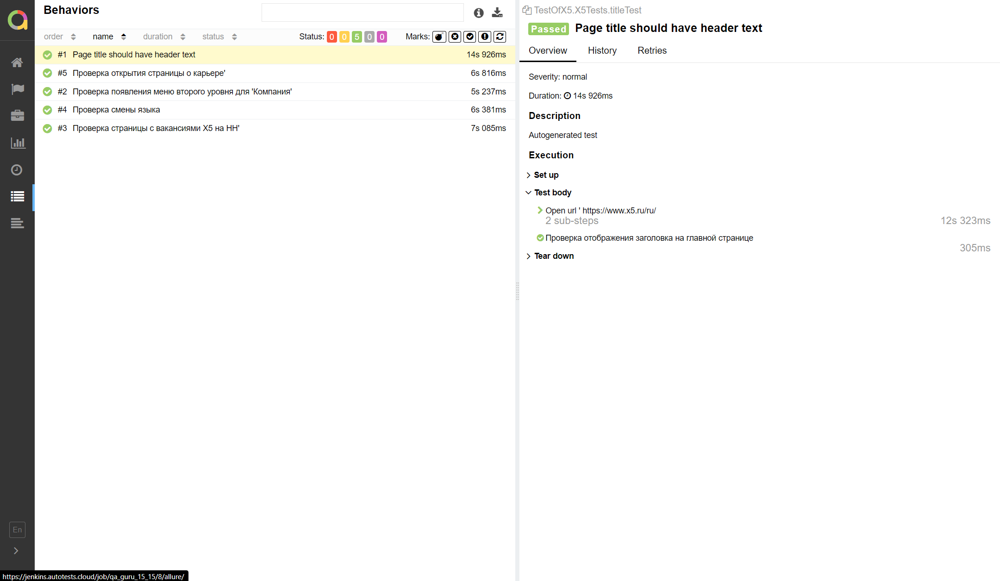

# Содержание:

- [Технологии и инструменты](#rocket-технологии-и-инструменты)
- [Реализованные проверки](#scroll-реализованные-проверки)
- [Сборка в Jenkins](#-jenkins-job)
- [Запуск из терминала](#earth_africa-Запуск-тестов-из-терминала)
- [Allure отчет](#-отчет-в-allure-report)
- [Отчет в Telegram](#-уведомление-в-telegram-при-помощи-бота)
- [Видео примеры прохождения тестов](#-примеры-видео-о-прохождении-тестов)


# Стек технологий:

<p align="center">
<a href="https://www.jetbrains.com/idea/"></a>
<a href="https://www.java.com/"></a>
<a href="https://github.com/"></a>
<a href="https://junit.org/junit5/"></a>
<a href="https://gradle.org/"></a>
<a href="https://selenide.org/"></a>
<a href="https://aerokube.com/selenoid/"></a>
<a href="https://github.com/allure-framework/allure2"></a>
<a href="https://www.jenkins.io/"></a>
</p>


# Реализованные проверки:

- Проверка отображения второго уровня меню для подпункта 'Компания' на главной странице.
- Проверка отображения второго уровня меню для подпункта 'Карьера' на главной странице.
- Проверка смены языка на EN на сайте Х5.
- Проверка отображения страницы с вакансиями компании на сайте Х5.
- Проверка отображения вакансий Х5 на сайте HH.


# </a> Jenkins job

</a>


# Параметры сборки в Jenkins:

* browser (default chrome, also safari ; firefox)
* browserVersion (default 99.0, 100.00)
* browserSize (default 1920x1080, 1024х768)
* remoteDriverUrl (url address from selenoid or grid)
* videoStorage (url address where you should get video)


# Команда запуска тестов из терминала:

```bash
gradle clean test
```

# Команды удаленного запуска:

```bash
clean test
-Dbrowser_name=${BROWSER_NAME}
-Dbrowser_version=${BROWSER_VERSION}
-Dbrowser_size=${BROWSER_SIZE} 
-Dselenide.remote=${REMOTE_URL}
```


# </a> Отчет в <a target="_blank" href="https://jenkins.autotests.cloud/job/qa_guru_15_15/8/allure/">Allure report</a>:


<p align="center">

</p>


# </a> Уведомление с результатами тестов в Telegram:

<p align="center">

</p>


# </a> GIF прохождения тестов:

<p align="center">
  
</p>

